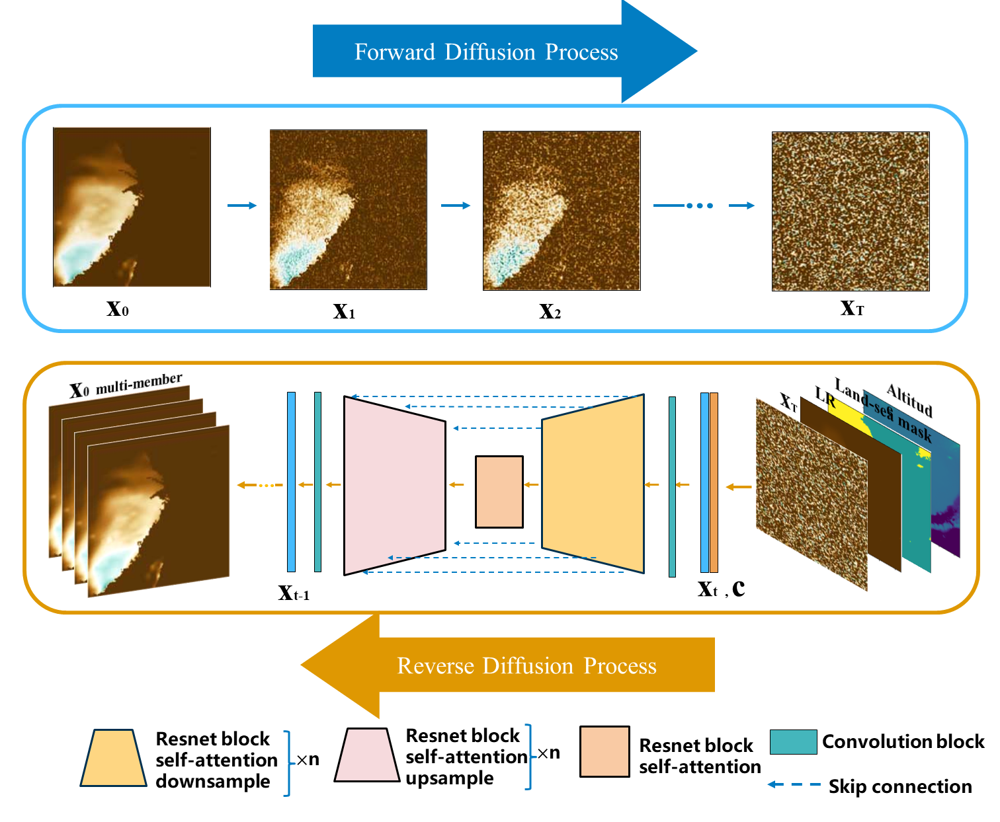

# Diffusion_4_downscaling

Diffusion Model-based Probabilistic Downscaling for Long-term East Asian climate reconstruction 

## References

- Liangwei Jiang (2021) Image-Super-Resolution-via-Iterative-Refinement [[Source code](https://github.com/Janspiry/Image-Super-Resolution-via-Iterative-Refinement#readme)]
- Song et al. (2021) Score-Based Generative Modeling through Stochastic Differential Equations [[Source code](https://github.com/yang-song/score_sde_pytorch)]
- Davit Papikyan et al. (2022) Probabilistic Downscaling of Climate Variables Using Denoising Diffusion Probabilistic Models[[Source code](https://github.com/davitpapikyan/Probabilistic-Downscaling-of-Climate-Variables/))]
- Robin Rombach et al. (2022)High-Resolution Image Synthesis with Latent Diffusion Models [[Source code](https://github.com/CompVis/stable-diffusion)]
- Cheng Lu et al. (2022) DPM-Solver: A Fast ODE Solver for Diffusion Probabilistic Model Sampling in Around 10 Steps[[Source code](https://github.com/LuChengTHU/dpm-solver/)]
